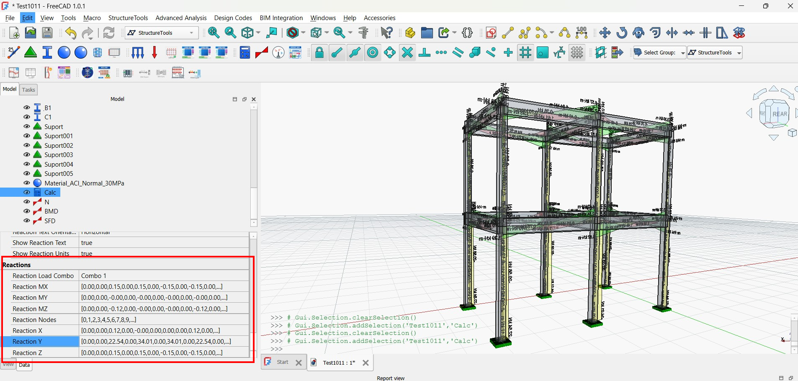

# Reaction Results Table Enhancement

## Overview
This enhancement allows users to view reaction forces and moments from previously calculated models in a tabular format, with export functionality to Excel, Word, and CSV formats.

## New Features

### View Reaction Table Command
- Added a new "View Reaction Table" command to easily access reaction data from existing calculations
- Automatically creates a reaction results object if one doesn't exist
- Handles previously calculated models that may have different attribute names

### Enhanced Reaction Results Handling
- Improved robustness of reaction results visualization
- Added support for detecting models stored in different attributes (model, FEModel, Proxy.model)
- Better handling of load combinations and default selections

### Table View Improvements
- Enhanced table view to show reaction forces and moments for all supported nodes
- Implemented automatic detection of calculation data from existing models
- Added export to Excel, Word, and CSV functionality

## How to Use

### For New Calculations
1. Create your structural model
2. Run the calculation
3. Use the "Reaction Results" button to visualize reactions in 3D
4. Click "Table View" in the reaction control panel to open the table view

### For Existing Calculations
1. Open a previously calculated model
2. Select the calculation object in the tree view
3. Click the "View Reaction Table" button in the toolbar
4. The system will automatically create a reaction results object if needed

### Export Options
- Export to Excel (.xlsx) - Requires openpyxl Python package
- Export to Word (.docx) - Requires python-docx Python package
- Export to CSV (.csv) - Built-in support, no additional dependencies

## Technical Improvements

### Robustness Enhancements
- Added additional error checking and fallback mechanisms
- Better attribute detection for different model storage approaches
- Improved handling of load combinations and their selection

### Code Structure
- Created dedicated command for direct access to reaction tables
- Enhanced reaction visualization with proper attribute checks
- Improved table formatting and export functionality

## Files Added/Modified

### New Files
- `command_reaction_table.py` - Command for viewing reaction tables
- `tests/test_reaction_table_enhancements.py` - Test script
- `resources/reaction_table.svg` - Icon for the new command

### Modified Files
- `reaction_results.py` - Enhanced model detection and visualization
- `reaction_table_panel.py` - Improved table display and export
- `init_gui.py` - Added command registration and toolbar/menu entries

## Testing
Run the test script to verify proper operation:
```python
import FreeCAD
FreeCAD.open("your_calculated_model.FCStd")
import sys
sys.path.append("path/to/StructureTools")
import tests.test_reaction_table_enhancements
tests.test_reaction_table_enhancements.run_tests()
```