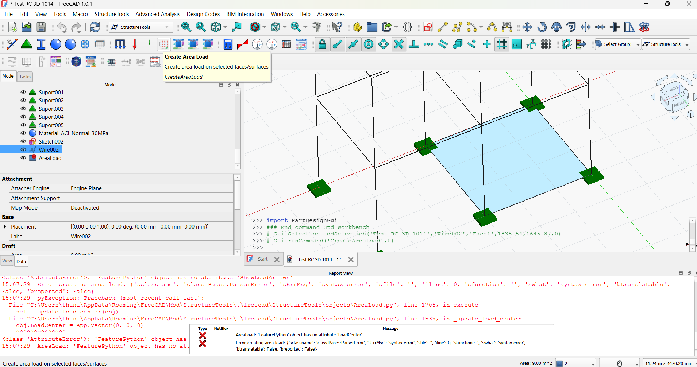

# Area Load User Guide

## Overview

The Area Load feature in StructureTools allows you to apply distributed loads to structural surfaces such as plates and shells. This guide will walk you through how to create, configure, and use area loads in your structural analysis models.
## Creating an Area Load

### Method 1: Using the GUI

1. **Access the Area Load Tool**
   - Open FreeCAD and load the StructureTools workbench
   - In the StructureTools toolbar, look for the "Area Load" button
   - Click the button to create a new area load object

2. **Set Target Faces**
   - Select the area load object in the model tree
   - In the Properties panel, find the "TargetFaces" property
   - Click the field and select the faces or plates you want to apply the load to

### Method 2: Using Python Scripting

```python
import FreeCAD as App
from freecad.StructureTools.objects.AreaLoad import AreaLoad

# Create a new area load object
doc = App.activeDocument()
area_load = doc.addObject("App::FeaturePython", "MyAreaLoad")
AreaLoad(area_load)

# Set target faces
area_load.TargetFaces = [your_plate_object]

# Recompute the document
doc.recompute()
```

## Configuring Area Load Properties

### Basic Properties

1. **Load Intensity**
   - Property: `LoadIntensity`
   - Description: The pressure magnitude of the load
   - Example: "5.0 kN/m^2" for a 5 kN/m² distributed load
   - Default: "2.4 kN/m^2" (typical dead load)

2. **Load Direction**
   - Property: `LoadDirection`
   - Description: Vector specifying the direction of the load in global coordinates
   - Example: App.Vector(0, 0, -1) for downward load
   - Default: App.Vector(0, 0, -1) (downward)

### Load Distribution Methods

The area load supports three distribution methods:

1. **One-Way Distribution**
   - Property: `LoadDistribution` = "OneWay"
   - Description: Load is transferred to two parallel edges
   - Additional properties:
     - `OneWayDirection`: "X", "Y", or "Custom"
     - `CustomDistributionDirection`: Vector for custom direction

2. **Two-Way Distribution**
   - Property: `LoadDistribution` = "TwoWay"
   - Description: Load is distributed based on relative span lengths
   - This is the default method

3. **Open Structure Distribution**
   - Property: `LoadDistribution` = "OpenStructure"
   - Description: Load is distributed based on projected area

### Load Case Properties

1. **Load Category**
   - Property: `LoadCategory`
   - Options: "DL", "LL", "LL_Roof", "W", "E", "H", "F", "T", "CUSTOM"
   - Default: "DL" (Dead Load)

2. **Load Case**
   - Property: `LoadCase`
   - Description: Identifier for the specific load case
   - Example: "DL1", "LL_office", etc.
   - Default: "DL1"

## Example Usage

### Simple Uniform Load

```python
import FreeCAD as App
from freecad.StructureTools.objects.AreaLoad import AreaLoad

# Create area load
doc = App.activeDocument()
area_load = doc.addObject("App::FeaturePython", "UniformLoad")
AreaLoad(area_load)

# Configure basic properties
area_load.TargetFaces = [your_plate]
area_load.LoadIntensity = "5.0 kN/m^2"
area_load.LoadDirection = App.Vector(0, 0, -1)  # Downward
area_load.LoadDistribution = "TwoWay"  # Default
area_load.LoadCategory = "LL"  # Live load
area_load.LoadCase = "LL_office"

doc.recompute()
```

### One-Way Load

```python
# Configure for one-way distribution
area_load.LoadDistribution = "OneWay"
area_load.OneWayDirection = "X"  # Load transfers in X direction
```

### Custom Direction Load

```python
# Configure for custom direction
area_load.LoadDistribution = "OneWay"
area_load.OneWayDirection = "Custom"
area_load.CustomDistributionDirection = App.Vector(0.707, 0.707, 0)  # 45-degree angle
```

## Visualization

The area load provides visual feedback in the 3D view:

1. **Load Arrows**: Show the direction and relative magnitude of the load
2. **Distribution Pattern**: Visual indicators for the load distribution method
   - One-Way: Lines showing the direction of load transfer
   - Two-Way: X-pattern showing bidirectional transfer
   - Open Structure: Grid pattern

### Visualization Controls

- `ShowLoadVectors`: Toggle load arrow visibility
- `VectorScale`: Adjust the scale of load arrows
- `ShowLoadDistribution`: Toggle distribution pattern visibility
- `DisplayDensity`: Control the density of visualization elements

## Running Analysis

To include area loads in your structural analysis:

1. Ensure your area load objects are included in the calculation object's `ListElements`
2. Run the structural analysis as usual
3. The area loads will be automatically converted to pressures on plates/quads

### Example Analysis Setup

```python
from freecad.StructureTools import calc

# Create calculation object
calc_obj = doc.addObject("App::FeaturePython", "Calculation")
calc_elements = [your_structure, your_area_load]
calc.Calc(calc_obj, calc_elements)

# Configure analysis parameters
calc_obj.LengthUnit = 'm'
calc_obj.ForceUnit = 'kN'
calc_obj.LoadCombination = '100_DL'  # 1.4DL for strength design

doc.recompute()
```

## Best Practices

1. **Coordinate System Awareness**
   - Remember the coordinate mapping:
     - FreeCAD X → Solver X
     - FreeCAD Y → Solver Z
     - FreeCAD Z → Solver Y

2. **Load Direction**
   - Use global coordinates for load direction
   - The effective pressure is calculated using the dot product with face normal

3. **Target Selection**
   - Ensure target faces are properly defined structural plates
   - For complex geometries, verify that loads are applied to the correct surfaces

4. **Distribution Method Selection**
   - Use One-Way for beams and joists
   - Use Two-Way for slabs and plates
   - Use Open Structure for grid systems

## Troubleshooting

### Common Issues

1. **Load Not Appearing in Analysis**
   - Check that the area load is included in the calculation object's `ListElements`
   - Verify that target faces are valid structural plates

2. **Incorrect Load Distribution**
   - Confirm the `LoadDistribution` property is set correctly
   - Check that `OneWayDirection` is properly specified for one-way loads

3. **Visualization Issues**
   - Toggle `ShowLoadVectors` and `ShowLoadDistribution` properties
   - Adjust `VectorScale` for better visibility

4. **Zero Load Effect**
   - Verify `LoadIntensity` is set to a non-zero value
   - Check that `LoadDirection` is not perpendicular to the surface

## Advanced Features

### Building Code Loads

The area load supports automatic load calculation based on building codes:

1. **Load Type**
   - Property: `LoadType`
   - Options: "Dead Load (DL)", "Live Load (LL)", etc.

2. **Building Code**
   - Property: `BuildingCode`
   - Options: "ASCE 7-16", "IBC 2018", etc.

3. **Occupancy Type**
   - Property: `OccupancyType`
   - Examples: "Office", "Residential", "Retail"

### Time-Dependent Loads

For loads that vary over time:

1. **Time Dependency**
   - Property: `IsTimeDependent`
   - Enable for time-varying loads

2. **Time Function**
   - Property: `TimeFunction`
   - Define custom time variation functions

### Environmental Loads

Specialized properties for environmental loads:

1. **Wind Loads**
   - `WindSpeed`: Basic wind speed
   - `ExposureCategory`: Wind exposure category

2. **Seismic Loads**
   - `SeismicAcceleration`: Peak ground acceleration

## Conclusion

The area load feature provides a powerful and flexible way to apply distributed loads to structural surfaces in FreeCAD. By understanding the different distribution methods and configuration options, you can accurately model various loading scenarios in your structural analysis.